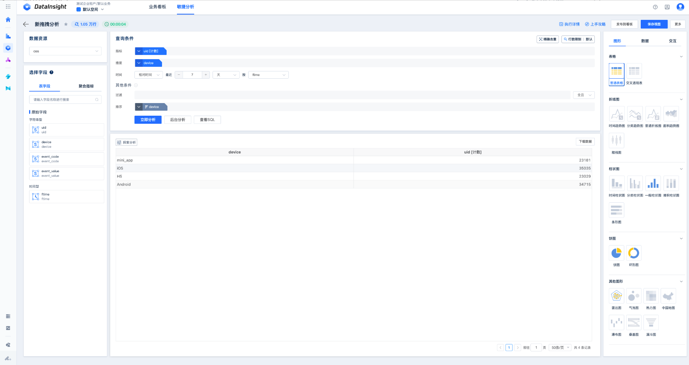
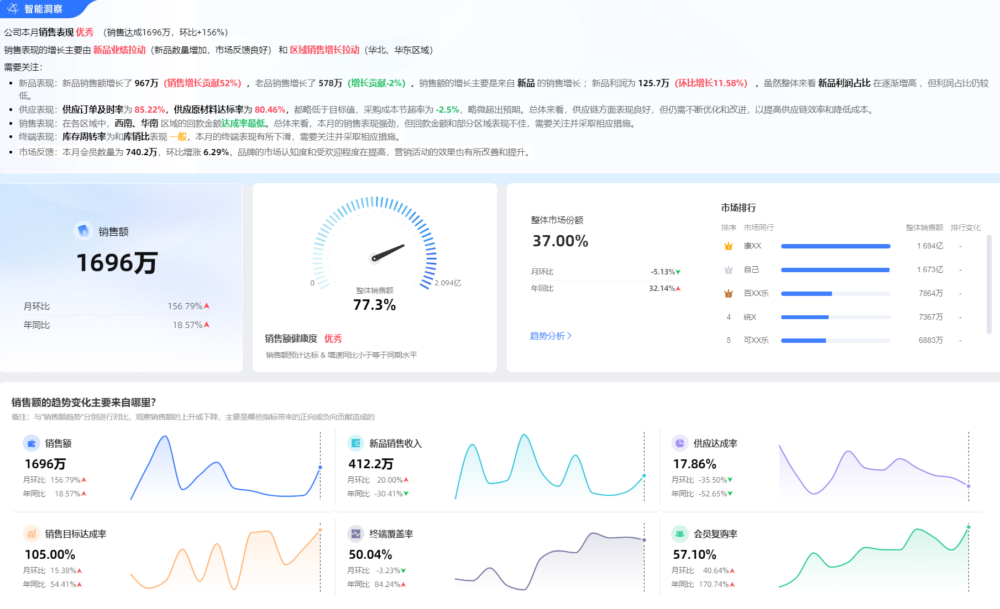

### 产品名称：腾讯灯塔Olachat
### 功能介绍：
腾讯灯塔属于一套端到端的全链路数据产品套件，它的目的是助力产品、研发、运营以及数据科学团队能在 30 分钟里做出更可靠且及时的决策，推动用户的增长与留存。

- 更合理的结合形态：融入当前BI流程处理单点问题，为用户提供贯穿于数据分析和仪表盘加工全流程的单点AI能力

- Text2拖拽分析能力：可以选择模型、表之后输入query，产品理解意图，模型生成查询条件生成结论

- AI出图能力：模型自动分类字段、填充显示名，选择合适的可视化组件呈现可以降低用户配置和选择组件的成本

- 结合推荐能力引导用户完成数据作业：根据环境信息、业务领域经验、状态信息、用户的个人意图等综合判断通过推荐算法引导用户至相应的数据结果

- 画布式形态：用户可干预分析思路

### 可借鉴之处：
1.结合推荐能力引导用户完成数据作业：根据环境信息、业务领域经验、状态信息、用户的个人意图等综合判断通过推荐算法引导用户至相应的数据结果

2.产品的弹出和交互需要与用户实际习惯的工作场景相结合，脱离业务主流程引导用户使用产品需要较高的培养成本

3.可视化的呈现效果美观且灵活，用户可通过画布中图表的拖拽干预分析思路

### 产品名称：[数势智能分析助手 - SwiftAgent](https://www.digitforce.com/product/sa/)

北京数势云创科技有限公司2021年创办。

CEO黎科峰，2020年时任京东集团副总裁、技术委员会主席、京东商城技术负责人。

1.数势科技：主要专注在为包括新零售、证券金融等领域的数字化升级的解决方案，包括在CDP（客户数据平台）、指标平台，智能营销平台的AI化建设。

2.使用的大模型：百川智能，智谱AI，以及文心一言

3.团队：扁平管理、个人独立项目

- 整个公司：200-300人

- 解决方案中心：100多人

- 组内有管理10几个人的小组长
### 功能介绍：
数势智能分析助手 - SwiftAgent 由数势科技打造。它以国产大模型为基座，结合数势指标平台技术，通过微调训练将大语言模型与数据分析深度融合。支持多模态交互查询，包括文本、语音、Excel 等输入方式，方便在不同场景使用。具备归因洞察分析、高级数据分析、图表自动推荐和生成、行业化报告生成、智能波动预警等功能，能快速定位数据变化原因、进行深度分析并直观呈现结果。其构建统一语义层，解决大模型对业务语义理解难题，统一企业数据口径。还支持用户干预，可根据反馈强化学习，持续反思学习并沉淀知识库。同时实现多源数据链接，包括非结构化知识，借助独创的数据计算加速引擎实现秒级查询，为用户提供高效、准确且贴合业务需求的数据分析服务。

- 仓外数据语义灵活便捷，更加贴近业务：数据建模右移，更加贴近数据消费endpoint，更便于LLM Agent规划推理。数据产品将指标、维度等一些核心要素做拼接，自然语义去解析提问中包含的原子指标、要素、时间等，提升识别准确性

- 大模型Agent架构结合数据语义层的架构：基于自然语言的数据分析，对获取的结果数据进行智能解读与归因，提升经营分析效率

- LUI+GUI融合的产品设计理念：LLM加持下，产品设计需要结合LUI（language user interface）与（graphic user interface）的优点，才能显著提升数据分析体验

- 让用户可以说企业内部的“黑话”：利用大模型原生知识库（ex.RAG），来更好地让用户说他熟悉的用词、短语和黑化，而不是强迫他说系统术语

- 追问机制：通过持续反思学习让大模型形成追问机制，帮助用户解决特定场景的问题

### 可借鉴之处：
1.LUI+GUI融合的产品设计理念：在用户提问模糊时通过用户在交互界面的干预，让LLM反问通过用户的二次确认协助澄清，解决维度、指标表达不清类似的问题。

2.通过通用文档、企业内部专有名词、场景分析模板的建设，维护后台知识库管理范围，让大模型更好理解企业内部的“黑话”，不强迫用户说系统术语，提升用户体验。

3.问题引导：

a.问题推荐：通过问题推荐引导用户在场景下提问，前端展示指标内容，引导用户提问。

b.刁钻/极端问题引导：将大问题拆解为小问题，将复杂的多指标维度或者模糊的提问拆解为简单的小问题后再回答

4.智能归因：大模型协同小模型的方式来完成，分析结果可由可视化的图表或报告来呈现。

a.维度归因：预先配置的维度，跑出不同维度的指标值，识别异常，实现归因

b.因子归因：通过公式能够计算的这类结构性的指标，通过单独的因子计算，能够拆解出对应的问题，通过积分的方式看每个因子对总体结果的影响。

c.异动分析：用户基于维度的归因分析想要追问某个具体维度下的异动分析，可以作为二期内容去做，主要是通过维护行业知识库的方式来引导大模型理解行业“黑话”更好的归因。同时可以引入外部数据进行分析。

###	产品名称：阿里云智能-智能小Q
### 功能介绍：
- 多端问数支持：PC及移动、嵌入自由系统

- 数据可视化多样化：数据结果支持图表切换、AI取数过程查看，易理解、可确信

- 支持数据洞察：支持查询数据结果的进一步拆解、趋势等推荐，从取数分析到洞察。支持多轮问答，进一步追问进行分析决策

- 问数结果分析或导出保存

### 可借鉴之处：
支持查询数据结果的进一步拆解、趋势等推荐，支持从取数分析到数据洞察

###	产品名称：Tellius
美国Tellius公司
### 功能介绍：
Tellius是一个增强型，集中的分析和BI平台，为消费者，分析师和数据科学家提供功能。它可以作为 SaaS 产品部署，部署在本地或客户选择的云平台中。

- Tellius处于Gartner的ABI Magic Quadrant的Visionaries象限，提供了ThoughtSpot类似的NLQ能力、基于ML算法提供洞察能力

- 基于“What”、“Why”、“How”三个层次对数据做不同程度见解：①What基于自然语言查询（NLQ）搜索支持；②Why自动揭示关键驱动因素和趋势，帮助用户理解数据模式背后的根本原因；③How帮助使决策者能够根据发现的洞察采取行动

- Tellius提供自动化分析、洞察能力，改善了报表（Dashboard）只能展示数据不能分析为什么会发生的难题，同时解决了人工分析耗时较长的问题。

- 支持可视化数据准备，支持基于Spark的自动物化，支持基于内存的数据缓存（In-Memory Mode），支持对接多种数据源（Live Mode）

### 可借鉴之处：
1.可以将“What”、“Why”、“How”的分析洞察框架引入到BA Copilot

2.Tellius基于ML的自动化洞察能力能给BA Copilot做Query2Insight & Query2Instruction提供建设思路

###	产品名称：[Qlik Sense](https://www.qlik.com/us)

美国Qlik公司
### 功能介绍：
Qlik Sense 是一款注重自助服务式数据分析和可视化的工具，最近集成了 AI 和机器学习能力。

- 关联分析：具有强大的关联分析能力，能够自动发现数据之间的关联和趋势，帮助用户深入了解数据的内在关系。

- 数据预警：支持设置数据预警功能，当数据达到用户设定的阈值时，系统会自动发出预警通知，帮助用户及时发现和解决问题。

- 协作共享：方便用户之间进行协作和共享，用户可以将自己的分析结果分享给团队成员，也可以查看和使用团队成员的分析成果，提高团队的协作效率。
### 可借鉴之处：
协同共享：可以将分析结果分享给其他成员，也可以查看团队成员的分析结果，但在落地BA Copilot时必须考虑数据权限问题。

###	产品名称：[KyligenceCopilot](https://cn.kyligence.io/copilot/#)

上海跬智信息技术有限公司
### 功能介绍：

Kyligence Copilot 是跬智信息推出的 AI 数智助理产品。它能快速评估关键业务指标、定位问题原因，自动发掘业务洞察，提供个性化交互，助力企业提高业务敏捷性和决策效率，降低数据驱动决策门槛，基于大语言模型服务和指标数据服务。

- 智能查询：支持智能查询功能，用户可以通过自然语言提问的方式获取所需的数据和分析结果，无需编写复杂的查询语句。

- 数据挖掘：能够进行数据挖掘和深度分析，帮助用户发现数据中的潜在模式和规律，为企业的决策提供有力支持。

- 自动化报告：可以自动生成数据分析报告，用户可以根据自己的需求选择报告的格式和内容，节省了报告制作的时间和精力。
### 可借鉴之处：
自动化工作流：用户在输入框中输入「创建任务」，可自动跳出「创建任务到飞书」的对话框，用户据此功能可快速指派任务。